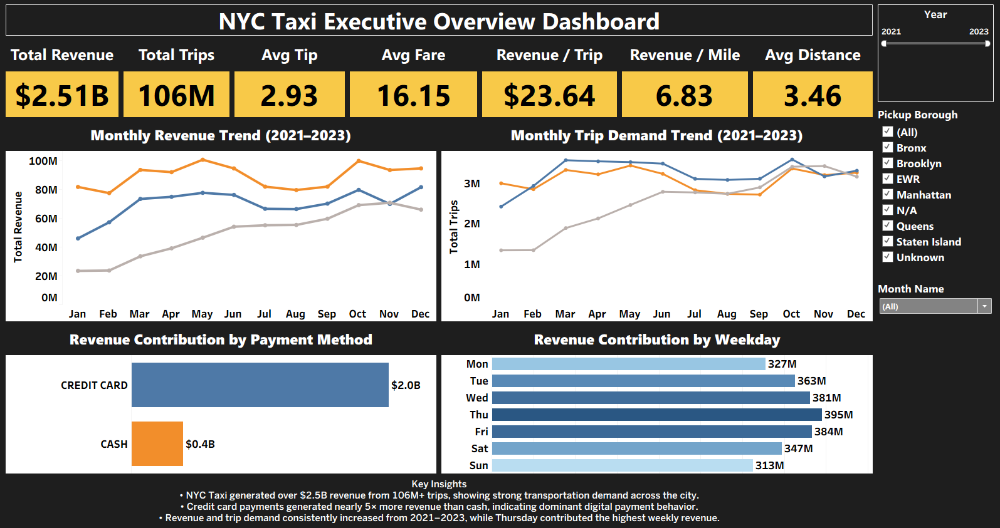
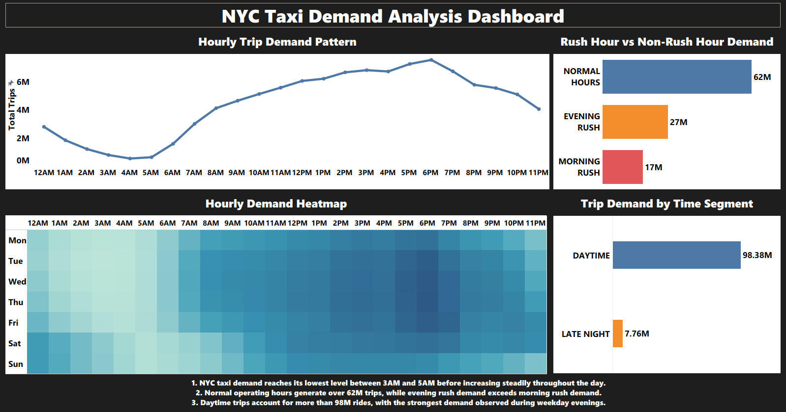
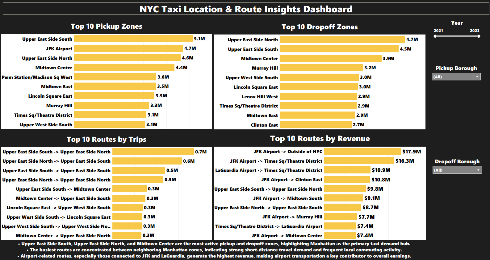
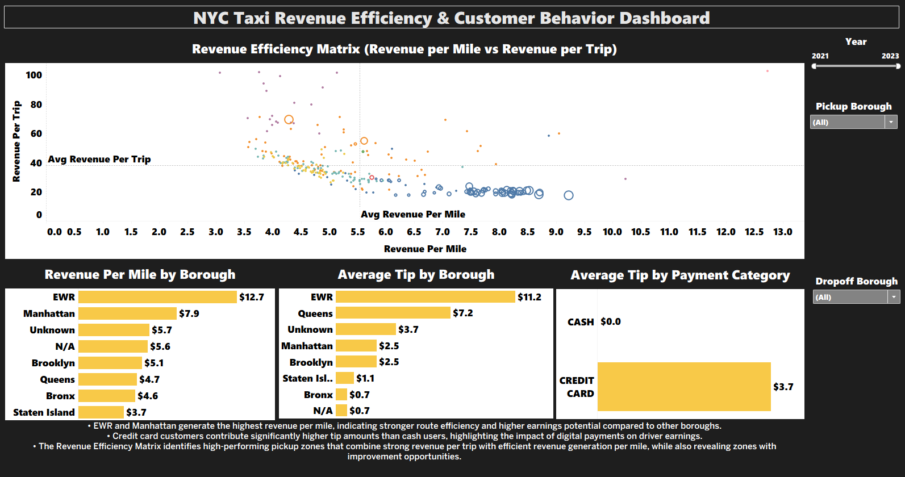

# 🚕 NYC Taxi Analytics 2021–2023
**106 Million Trips | Python • Snowflake • SQL • Tableau**

---

## 🔗 Links
| 📓 Python EDA | ❄️ SQL Analysis |
|---|---|
| [View Notebook](https://colab.research.google.com/drive/1ht40cdzSkwUeO6schjpkF9StEwuu6V6p?usp=sharing) | [View SQL](https://github.com/vipulpurohit851-bit/nyc-taxi-analytics/blob/main/NYC_TAXI_ANALYSIS.sql) |

---

## 📌 Objective
Analyze NYC Taxi post-COVID recovery (2021–2023) across **106 Million trips** to identify revenue trends, demand patterns and business opportunities.

---

## 🔑 Key Findings
- 💰 Revenue grew **79%** → $608M to $1.09B
- 🏆 2023 crossed **$1 Billion** revenue
- ⏰ Peak hour → **6 PM** | Busiest day → **Thursday**
- 💳 Credit card payments grew **73% → 80%**
- ✈️ **JFK Airport** = highest revenue routes

---

## 📊 Dashboards

**Executive Overview**

**Demand Analysis**

**Location & Routes**

**Revenue Efficiency**

---

## 🛠️ Tools Used
`Python` `Snowflake` `SQL` `Tableau` `Pandas` `Matplotlib` `Seaborn`

---

## 👨‍💻 Vipul Rajpurohit
BCA Graduate | Aspiring Data Analyst | Open to Opportunities

